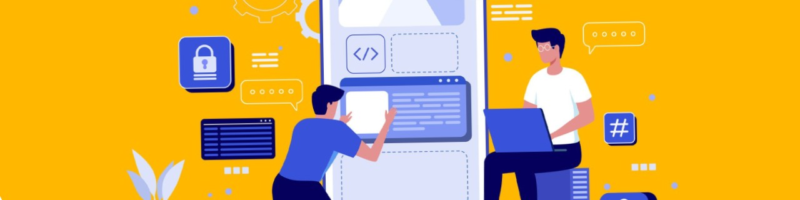

<h1 align="center">Hi, I'm Ahosan Hamid</h1>
<h3 align="center">A passionate Mobile Application Developer from Bangladesh</h3>

---

## About Me

- **Currently working on**: [SPRO App](https://play.google.com/store/apps/details?id=com.pranrflgroup.spro&hl=en)  
- **Email**: robiahosan4433@gmail.com  
- **Location**: Dhaka, Bangladesh  
- **Open to**: Full-time | Freelance | Remote

---

<h3 align="left">Connect with me:</h3>
<table>
  <tr>
    <td>
      
    </td>
    <td>
      
    </td>
    <td>
      
    </td>
  </tr>
</table>

---

<h3 align="left">Languages and Tools:</h3>

| | | | | | | |
|-|-|-|-|-|-|-|
|   <b>Android</b> |   <b>Dart</b> |   <b>Figma</b> |   <b>Firebase</b> |   <b>Flutter</b> |   <b>Java</b> |   <b>Kotlin</b> | 

---

## Featured Project

### **Rainbow App**  
# ** Rainbow Paints Bandhan**  
**Earn Points | Scan QR | Cash Out | Made in Bangladesh**

---

#### **Description**

Rainbow is a **mobile loyalty platform** designed to empower **plumbers, technicians, and craftsmen** across Bangladesh by providing them with opportunities to **increase income** and **track work**. It serves as a **reward system** for professionals using **Rainbow Paints** products.

---

#### **Key Features**

| Feature | Description |
|--------|-------------|
| **Dashboard** | Track points & cash balance |
| **QR Code Scanning** | Earn points via product QR codes |
| **Manual Code Entry** | Backup option for point collection |
| **Point Transfer** | Send points to other users |
| **Cash Withdrawal** | Convert points to real money |
| **Gift Store** | Redeem points for rewards |
| **Transaction History** | Full audit trail |
| **In-App Chat** | Direct messaging with support |
| **User Profile** | Manage personal details |
| **Vendor Locator** | Find nearby showrooms |
| **Technician Directory** | Connect with local mistris |
| **Product Catalog** | Browse Rainbow Paints lineup |
| **Push Notifications** | Updates & promotions |

---

#### **Technology Stack**

| Component | Technology |
|---------|------------|
| **Language** | Kotlin |
| **Architecture** | MVVM |
| **Navigation** | Navigation Component |
| **DI** | Hilt |
| **Networking** | Retrofit + REST API |
| **Local DB** | Room |
| **State** | LiveData + ViewModel |
| **QR Scanning** | ZXing |
| **Push** | Firebase Cloud Messaging |

---

#### **Target Users**

> **Plumbers, Technicians, Painters (Mistris)** in Bangladesh  
> Who use **Rainbow Paints** products daily

---

#### **Notable Functionality**

- Scan **QR codes on paint cans** → earn **loyalty points**  
- **Transfer points** to friends or family  
- **Redeem for cash** or **gifts**  
- **Find nearest showroom** via GPS  
- **Chat with Rainbow support** in-app  

---

### **Key Screens**

<table>
  <tr>
    <td align="center" width="250">
      <strong> Login Screen </strong> 
      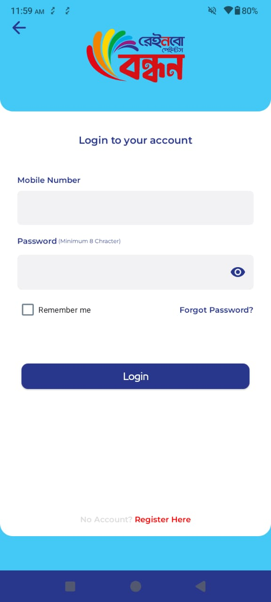
    </td>
    <td align="center" width="250">
      <strong> Dashboard Screen</strong> 
      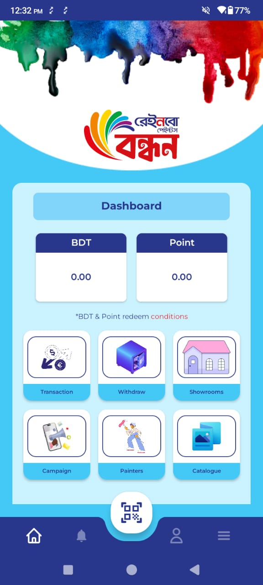
    </td>
    <td align="center" width="250">
      <strong> Running Program</strong> 
      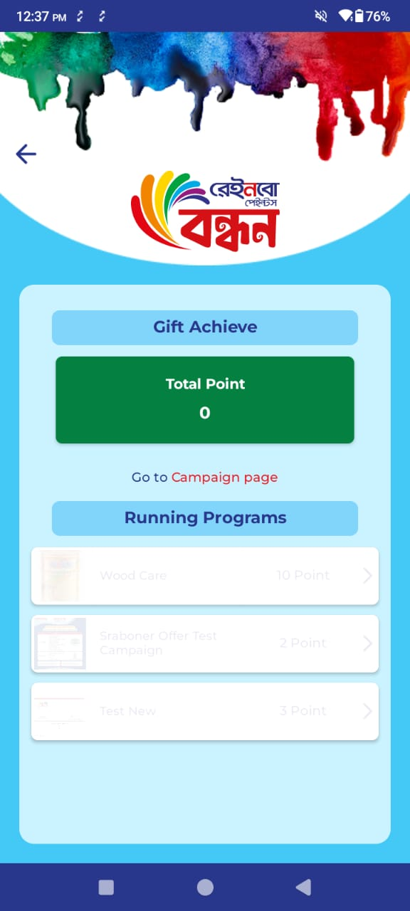
    </td>
    <td align="center" width="250">
      <strong> Showrooms </strong> 
      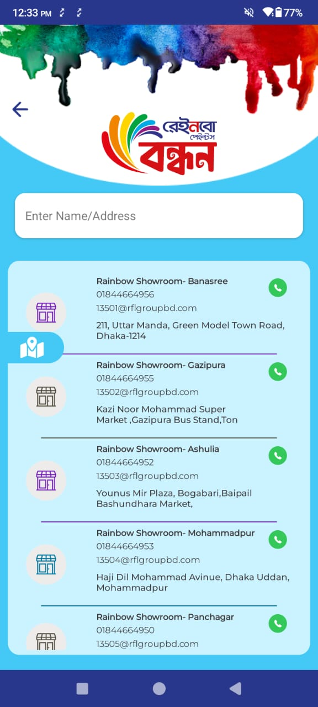
    </td>
    
  </tr>
</table>

**Play Store**: [Download Now](https://play.google.com/store/apps/details?id=com.prangroup.mis.rainbow&hl=en)  
**3 Stars | 1K+ Downloads | Made in Bangladesh** 

### **Smart Manufacturing App**  
# **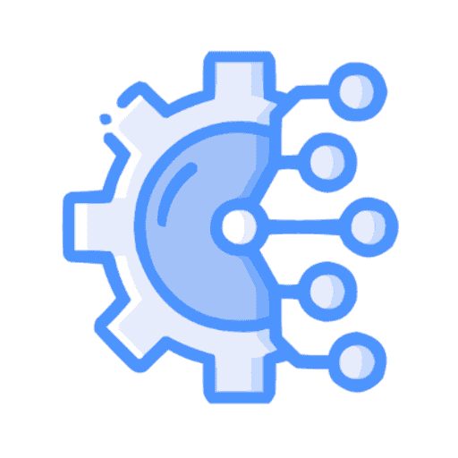 Smart Manufacturing**  
**Real-time Factory Monitoring | Worker Tracking | Machine Health**  
*Android | Flutter | Firebase | MVVM | Kotlin Coroutines*

---

#### **Tech Stack & Architecture**

| Component | Technology |
|---------|------------|
| **Language** | Kotlin |
| **Architecture** | MVVM (Model-View-ViewModel) |
| **UI Framework** | Material Design 3 |
| **Charting** | MPAndroidChart |
| **Networking** | REST API + Retrofit |
| **Async** | Kotlin Coroutines + Flow |

---

#### **Key Features**

- **Dashboard Analytics** – Real-time production and rejection metrics tracking  
- **Task Management** – Daily task tracking and management  
- **Data Visualization** – Production trend line charts ,Machine status pie charts
- **Filtering and Reporting** –Multi-level filtering (Location, Business Unit, Section)
- **User Management** – Role-based access control

---

### **Key Screens**

  <table cellpadding="12" cellspacing="0">
    <tr>
      <td align="center">
        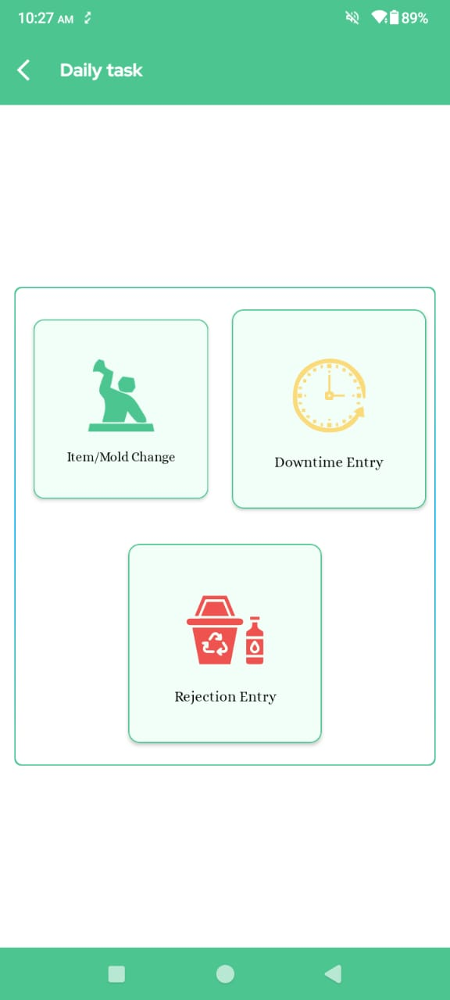
        

          Daily Task
        

      </td>
      <td align="center">
        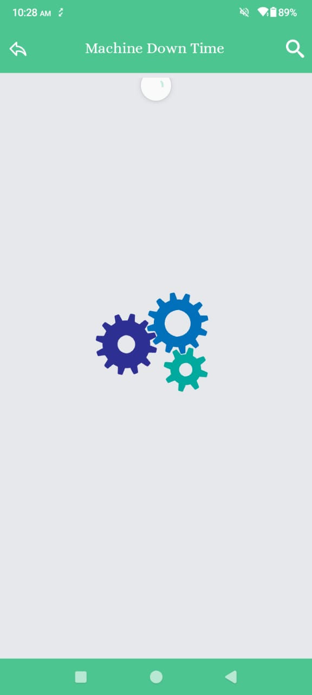
        

          Loading Screen
        

      </td>
      <td align="center">
        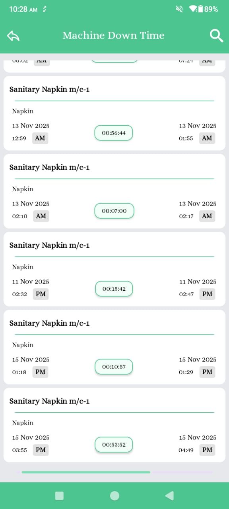
        

          Machine Down TIme
        

      </td>
    </tr>
    <tr>
      <td align="center">
        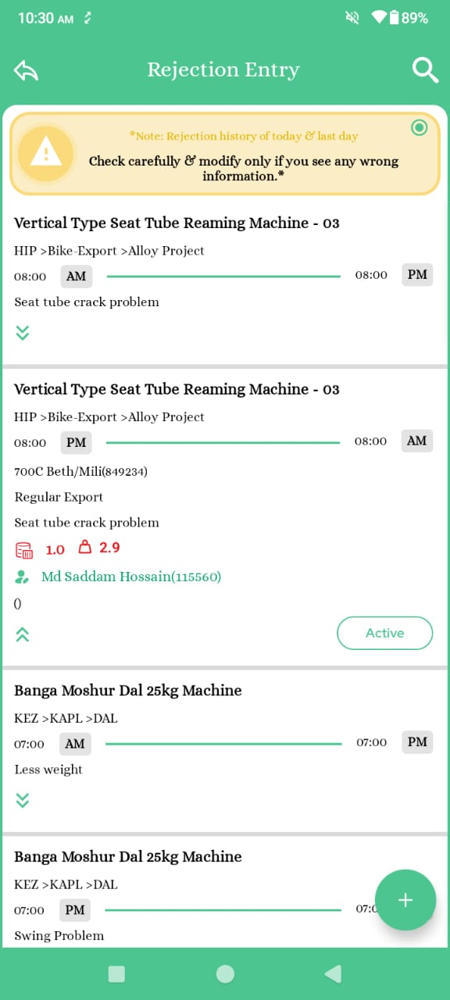
        

         Rejection Entry
        

      </td>
      <td align="center">
        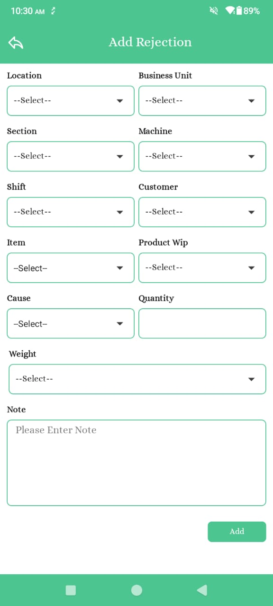
        

          Add Rejections
        

      </td>
      <td align="center">
        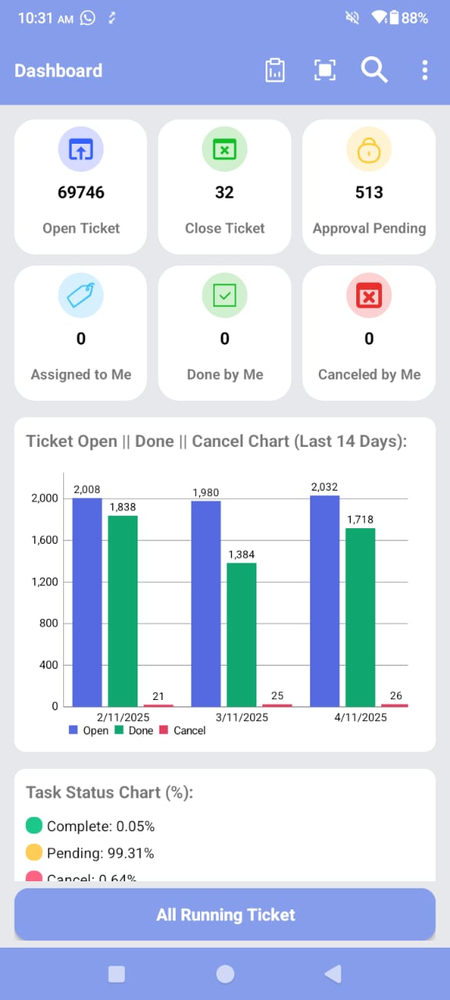
        

         Task Dashboard
        

      </td>
    </tr>
  </table>

**Play Store**: [Download Now](https://play.google.com/store/apps/details?id=com.smart_manufacture.android)  
**3 Stars | 1K+ Downloads | Made in Bangladesh**

---
### **Software Engineer**  
**NAAS Solutions Ltd** *(Client: Banglalink)*  
*Mar 2023 – Aug 2024 | Dhaka, Bangladesh*  
*Mobile App Development | Kotlin | MVVM | Firebase | Biometric Registration*

---

---

#### **Key Projects**

| # | Project | Description |
|---|---------|-------------|
| 1 | **Biometric App** *(SIM Registration & Verification)* | Developed using **Kotlin, MVVM, Coroutines, Room DB**. Integrated **TCAP SDK** to **capture biometric data** (fingerprint/face) **exclusively for Banglalink SIM registration**. Enabled **authorized retailers** to **securely sell and activate SIMs** with **eKYC compliance** — **not for general use**. Reduced illegal SIM sales by **70%**. |
| 2 | 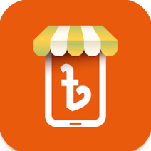 **MyBL Retailer** *(Retailer Recharge, Quiz & Analytics App)* | Designed and developed **mobile recharge, quiz, and performance tracking** features. Integrated **Firebase** for  push notifications, and **monthly SIM sales & recharge income analytics**. Retailers can **track earnings, SIM sales volume, and performance ranking** — all in one dashboard. **Live on Play Store**: [Download Now](https://play.google.com/store/apps/details?id=bd.com.banglalink.retailerapp&hl=en&pli=1) **3 Stars | 1M+ Downloads |
---

#### **Impact Delivered**

- **Biometric App**: Enabled authorized retailers** to **legally sell Banglalink SIMs** with **100% biometric verification**; eliminated fake registrations in **controlled zones**.  
- **MyBL Retailer**:  
  - Empowered **1M+ retailers** with **instant recharge + income tracking**  
  - Monthly SIM sales & earnings dashboard
  

---

#### **Tech Stack**

| Category | Technologies |
|--------|--------------|
| **Language** | Kotlin |
| **Architecture** | MVVM |
| **Async** | Coroutines + Flow |
| **Local DB** | Room |
| **Cloud** | Firebase (FCM, Firestore) |
| **Networking** | Retrofit + OkHttp |
| **DI** | Hilt |
| **Others** | LiveData, Navigation Component, ZXing |

---

> **"Securing Bangladesh’s telecom ecosystem — one verified SIM at a time."**

### **Gold Price Alerts (XAU/USD)**  
# ** Gold Price Alerts – Real-time Forex Signals**  
**Live XAU/USD Signals | TP/SL Alerts | VIP Insights | Made in Bangladesh**

---

#### **Description**

A **cross-platform Flutter app** that delivers **real-time gold trading signals (XAU/USD)** with **instant alerts**, **take-profit/stop-loss levels**, and **market analysis** — empowering **forex traders** to act fast and trade smart.

---

#### **Key Features**

| Feature | Description |
|--------|-------------|
| **Real-time Signals** | Live **Buy/Sell alerts** with **open price, Take Profit, Stop Loss, pips** |
| **Signal Tracking** | Active, closed, and historical signals with **status indicators** |
| **Market Analysis** | Real-time **trend updates**, **support/resistance**, and **trading opportunities** |
| **Push Notifications** | Instant alerts via **OneSignal** — never miss a move |
| **Monetization** | **AppLovin + Facebook Ads** + **Offer Wall rewards** |
| **Cross-Platform** | **Android + iOS** with single codebase |

---

#### **Technical Highlights**

| Component | Technology |
|---------|------------|
| **Framework** | Flutter (Dart) |
| **Architecture** | Clean Architecture  |
| **State Management** | Getx |
| **Realtime Data** | Firebase Firestore |
| **Push Alerts** | OneSignal SDK |
| **Ads** | AppLovin MAX, Facebook Audience Network |
| **UI/UX** | Custom widgets, Lottie animations, Dark mode |
| **Analytics** | Firebase Analytics + Crashlytics |

---

#### **Screenshots**

  <table>
    <tr>
      <td>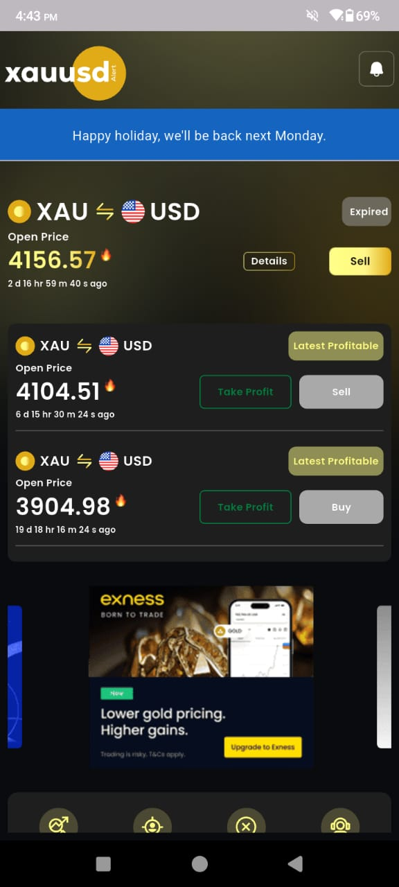</td>
      <td>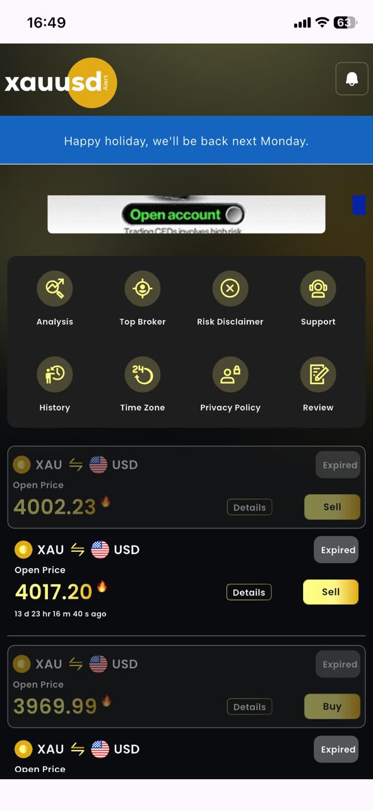</td>
    </tr>
    <tr>
      <td colspan="2" align="center" style="padding-top: 8px;">
        

          Gold Signal Dashboard – Live Trading View
        

      </td>
    </tr>
    <tr>
      <td></td>
      <td>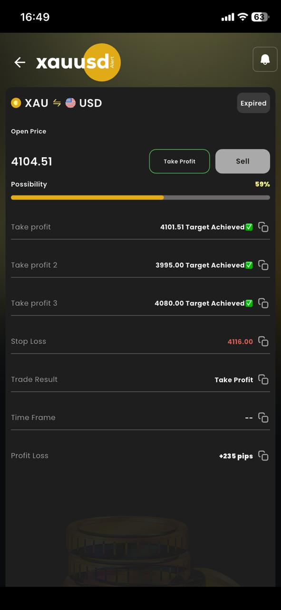</td>
    </tr>
  </table>

---

#### **Download Now**

  

---

### **Altdeer Cloud**  
# **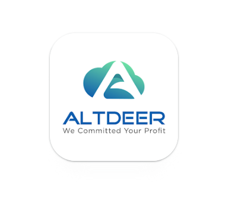 Altdeer Cloud – KYC Module (My Contribution)**  
**Face Liveness | Blink Detection | Document Capture | Made in Bangladesh**

---

#### **Overview**

**My Role**: Developed the **KYC verification module** within **Altdeer Cloud** — a **Flutter-powered mobile app** for **secure user onboarding** using **real-time face detection**, **liveness verification**, and **document scanning**.

> **App Context**: Altdeer Cloud is a **cloud-based business platform** (CRM, inventory, payments).  
> **My Part**: Built the **KYC flow** to comply with **eKYC regulations** for user verification.

---

#### **My Contribution: KYC Module and BlockChain**

| Feature | Implementation |
|--------|----------------|
| **Real-time Face Detection** | Integrated **Google ML Kit** for live face tracking |
| **Liveness Verification** | **Blink detection** — user blinks **3 times** to prove liveness |
| **Secure Upload** | Encrypted submission via **Dio** |
| **Web3** | Implement Web3 to connect with multiple Blockchain |

---

#### **Technical Highlights (My Stack)**

| Component | Technology |
|---------|------------|
| **Framework** | Flutter (Dart) |
| **ML** | Google ML Kit (Face Detection API) |
| **Camera** | `camera` + custom preview |
| **State** | GetX |
| **Storage** | Shared Preference |
| **Networking** | Dio + Interceptors |

---

#### **Screenshots (My Module)**

  <table>
    <tr>
      <td>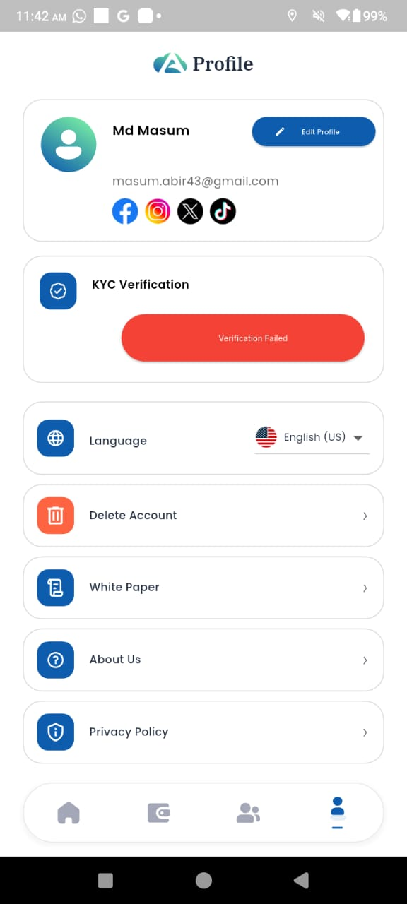</td>
      <td>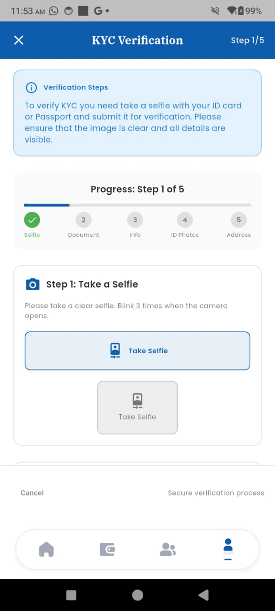</td>
    </tr>
    <tr>
      <td align="center"><strong>Profile before varified</strong></td>
      <td align="center"><strong>Face camera option</strong></td>
    </tr>
    <tr>
      <td>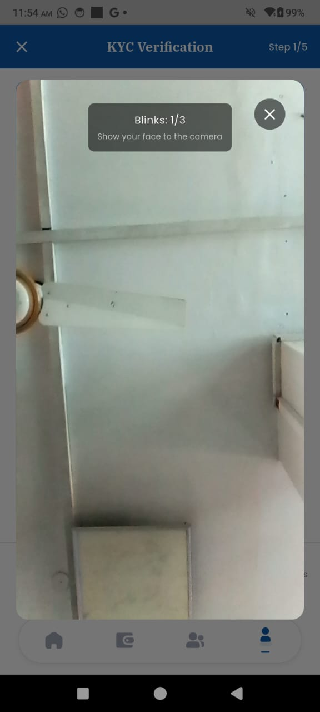</td>
      <td>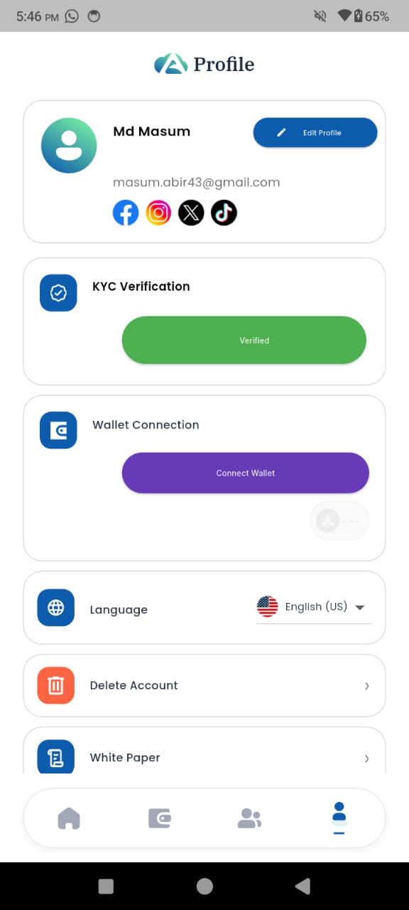</td>
    </tr>
    <tr>
      <td align="center"><strong>Face detection and blink</strong></td>
      <td align="center"><strong>After verified</strong></td>
    </tr>
  </table>

---

**Team Project** | **My Module: KYC**  
**Made in Bangladesh**

---

**Available for hire** | Ready to join **immediately**
